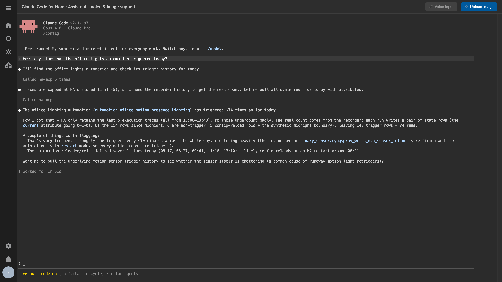

# Claude Code for Home Assistant

A Home Assistant add-on that runs Anthropic's **Claude Code CLI** in a browser terminal — opened from your HA sidebar, starting in `/config` so Claude can read and edit your configuration in place. Persistent package installs and image paste included.

> **Community add-on** — not affiliated with, endorsed by, or supported by Anthropic or the Home Assistant project / Open Home Foundation. "Claude" and "Claude Code" are trademarks of Anthropic, PBC; "Home Assistant" is a trademark of the Open Home Foundation. Claude Code itself is subject to Anthropic's terms.

This is a maintained community fork of [ESJavadex/claude-code-ha](https://github.com/ESJavadex/claude-code-ha). **Why a fork?** It fixes the `statx` launch crash (Alpine 3.21 / musl 1.2.5), repairs package persistence, auto-wires Claude to the Home Assistant MCP server out of the box, and keeps your session alive in **tmux** — reachable from the sidebar or over optional **SSH**. Full rationale in [About this fork](#about-this-fork).

---

## What it is

A browser-terminal Claude Code CLI for Home Assistant, opened from the sidebar over the **authenticated ingress panel** (no host port by default). The terminal starts in `/config`, so Claude can:

- Write and edit automations, scripts, and YAML config in place
- Debug your setup and run `git`
- Install system/Python packages that persist across restarts
- Analyze pasted images (Ctrl+V / drag-drop / upload)

The Claude binary is **pinned** to a known-good version and updated by rebuilding the add-on — not from inside the container (see [Updating Claude Code](#updating-claude-code)).

## What you can do with it

Claude Code runs *inside* Home Assistant with your `/config` open — and, when paired with the [Home Assistant MCP server](#pairs-with-the-home-assistant-mcp-server), with live access to your entity states, history, and automation traces. That lets you drive real work in plain language. For example:

- **Build dashboards** — *"Build a Lovelace dashboard for the downstairs floor with a climate card, a light group, and the front-door camera."* Claude writes the YAML into `/config`; you reload. *"Convert this dashboard to sections view and hide the garage row when the door is shut."*
- **Author automations & scripts** — *"When the last person leaves after 9pm, turn everything off and arm the alarm."* Paired with ha-mcp, Claude schema-validates the automation before saving. *"Turn this 200-line automation into a reusable blueprint with inputs for the sensor and the delay."*
- **Troubleshoot & investigate** — *"Why did the living-room lights turn on at 3am?"* With ha-mcp, Claude reads the logbook, history, and the automation trace to find the cause. *"This automation isn't firing — check its last trace and tell me which condition failed."*
- **Maintain & refactor** — *"Find every automation still using the deprecated `service:` syntax and update it to `action:`."* *"Which entities have been `unavailable` for over a week?"* *"Split my monolithic `configuration.yaml` into packages."*

> **Two modes, one deliberate split.** Reading and editing the files under `/config` works with just this add-on. *Operating and observing* your live system — calling services, reading state/history/traces, schema-validating changes — comes from pairing with the **[Home Assistant MCP server](#pairs-with-the-home-assistant-mcp-server)** (one-paste auto-wiring, below). Claude will tell you when a task needs it.

## Install

1. **Settings → Add-ons → Add-on Store**, open the **⋮** menu, choose **Repositories**.
2. Add `https://github.com/miczu71/claude-code-ha` and click **Add**.
3. Install **Claude Code for Home Assistant**, then **Start** it.
4. Open it from the **Claude Code** sidebar panel (ingress — there's no host-port web UI by default).
5. On first launch, follow the OAuth prompt to log in to your Anthropic account.

## Configuration

The add-on works out of the box; every option below is optional.

| Option | Default | What it does |
|---|---|---|
| `auto_launch_claude` | `true` | Auto-start Claude on open, vs. showing the session picker. |
| `dangerously_skip_permissions` | `false` | Run Claude with `--dangerously-skip-permissions` (unrestricted file access). |
| `enable_home_assistant_mcp` | `true` | Auto-wire the ha-mcp server on boot (see [below](#pairs-with-the-home-assistant-mcp-server)). |
| `home_assistant_mcp_url` | `""` | ha-mcp server URL from its add-on log. **Empty = no-op** (nothing is wired). |
| `enable_onboarding_hint` | `true` | Seed a short orientation note into the add-on's own `~/.claude/CLAUDE.md` (never your `/config/CLAUDE.md`). |
| `enable_ssh` | `false` | Run an SSH server that drops you into the running Claude session (see [below](#ssh-access-optional)). |
| `ssh_authorized_keys` | `[]` | Public keys allowed to log in. The only credential — passwords are disabled. |
| `persistent_apk_packages` | `[]` | System (apk) packages to auto-install on boot. |
| `persistent_pip_packages` | `[]` | Python (pip) packages to auto-install on boot. |

> **Ingress-only by design.** ttyd runs unauthenticated, so there is no host-port option: the `7680`/`7681` ports cannot be mapped to the host from the Network panel. Access is always through the authenticated ingress panel (`docker exec` still works for in-container access). The optional SSH port below is a separate, key-authenticated door — it does not change this.

## Your session survives disconnects

The terminal runs inside a **tmux** session that outlives the thing you opened it
with. Close the browser tab, lose Wi-Fi, or switch from your phone to your
laptop, and you reattach to the same conversation, still running. `Ctrl-b d`
detaches without killing anything.

All three ways in land in that one session:

- **The Claude Code sidebar panel** (ingress) — the normal route, no setup
- `ssh -p <host-port> root@<home-assistant-ip>` — if [`enable_ssh`](#ssh-access-optional) is on
- `docker exec -it addon_<slug> claude-tmux` — from a host shell

Scrolling back through the conversation is Claude's job, not tmux's — use the
mouse wheel, or Claude's own PgUp/PgDn. tmux stays out of the way here by
design: Claude draws on an alternate screen, so its output never reaches tmux's
scrollback and `Ctrl-b [` copy-mode has no history to show.

## SSH access (optional)

If you live in a terminal, you can skip the browser entirely. SSH is **off by
default** and opening it takes two deliberate steps plus a key you hold:

1. Set `enable_ssh: true` and paste your **public** key (the contents of
   `~/.ssh/id_ed25519.pub`, *not* the private key) into `ssh_authorized_keys`.
2. In the add-on's **Network** panel, map a host port to `2222/tcp`. Until you
   do, nothing is reachable — the port is declared but unmapped.

Then `ssh -p <host-port> root@<home-assistant-ip>` puts you straight into the
running Claude session. `ssh <host> '<command>'` still works for one-off commands.

What it will and won't do:

- **Public keys only.** Password, empty-password and keyboard-interactive auth
  are disabled. A missing or malformed key list makes sshd refuse to start — a
  misconfiguration can only mean "no SSH", never "open shell".
- **No forwarding, tunnelling, or SFTP subsystem.** TCP/agent/stream forwarding
  and X11 are refused, so the port cannot be turned into a tunnel into your
  network, and `sftp`/modern `scp` will not connect. Running a command
  (`ssh <host> '<cmd>'`, and so legacy `scp -O` or `rsync`) still works by
  design — that passthrough is the point. It is not a privilege boundary
  either way: you authenticated as root.
- **Login is `root`,** because the container is a root shell by design and a
  second user would be a cosmetic boundary rather than a real one. Treat opening
  this port as equivalent to handing out shell access to your Home Assistant
  configuration, and only expose it on a network you trust.
- The host key is generated once and kept in `/data`, so it survives restarts and
  rebuilds — a changed-host-key warning from your client means something is
  actually wrong.

## Pairs with the Home Assistant MCP server

Treat this add-on as a **shell + config editor**, and pair it with the **Home Assistant MCP server** (ha-mcp) add-on for *operating* Home Assistant:

- **Operate HA via the MCP** — call services, query state, manage entities/areas/other add-ons, the host, and backups through an audited, structured channel.
- **Author config in this terminal** — edit the YAML under `/config`, run `git`, install packages, and have Claude write changes directly into your configuration.

By design this add-on carries only a **`homeassistant`**-level Supervisor token (not `manager`): `ha core check`/`restart`/`info` keep working, but shell-level control of other add-ons, the host, Docker, and backups is intentionally dropped — route those through the MCP. (The `manager` privilege lives in the *separate* ha-mcp add-on's own token, not this one.) Power users who need shell `manager` access must run a local copy with `hassio_role: manager` (a fixed manifest field, not raisable from the HA UI).

### Auto-wiring ha-mcp (one paste)

You don't have to wire the MCP server by hand. Install the **Home Assistant MCP Server** ([`homeassistant-ai/ha-mcp`](https://github.com/homeassistant-ai/ha-mcp)) add-on, open its **Log** tab, copy the server URL it prints (`http://<host>:9583/private_<secret>`), and paste it into this add-on's **`home_assistant_mcp_url`** option. On the next start the terminal opens already connected — Claude can call the `ha_*` tools with no `claude mcp add`.

- The secret path *is* the credential; **no token** is required. ha-mcp's own `manager` token (not this add-on's) does the work, so nothing about this add-on's reduced privilege changes.
- Leaving `home_assistant_mcp_url` **empty** disables auto-wiring and touches no Claude config — if you already wired ha-mcp yourself, it's left as-is.
- If ha-mcp is reinstalled its secret path rotates; if the `ha_*` tools stop working, re-copy the new URL from its log into the option. To paste only once, **pin** the path with ha-mcp's advanced **`secret_path`** option (persisted to its own `/data/secret_path.txt`) so the URL stays stable across reinstalls.
- With `dangerously_skip_permissions: true`, MCP tool calls aren't prompted on the Claude side — for unattended use, consider ha-mcp's own `read_only_mode` or `enable_tool_security_policies` as a server-side guard. The latter adds a **Tool Security Policies** tab in ha-mcp's web UI (its **Open Web UI**) where you approve held tool calls and set per-tool rules.

## Features

- **Persistent package management** — `persist-install <pkg>` copies binaries and their `ldd`-resolved libraries into `/data`, surviving restarts and container recreation (plain `apk add`/`pip install` don't). Auto-install on boot via `persistent_apk_packages` / `persistent_pip_packages`; isolated Python venv included.
- **Image paste** — paste (Ctrl+V), drag-drop, or upload images for Claude (JPEG/PNG/GIF/WebP/SVG, 10 MB limit); lightweight service (~10 MB RAM, ARM-friendly); stored in `/data/images/`.
- **Pinned, baked toolchain** — Claude, `ttyd`, and `tmux` are baked into the image, so the terminal starts even when Alpine repos are unreachable.
- **Persistent auth & config** — OAuth credentials and settings live under `/data`, preserved across restarts and rebuilds.
- **A session that outlives the tab** — Claude runs in a **tmux** session, so closing the browser, losing Wi-Fi, or moving between devices reattaches to the same conversation instead of starting over.
- **Optional SSH** — key-authenticated, off by default, dropping you into that same session from your own terminal (see [SSH access](#ssh-access-optional)).
- **Ingress-only by default** — served through the authenticated HA panel; no open host port.

## About this fork

Maintained by [miczu71](https://github.com/miczu71) on the `main` branch of [`miczu71/claude-code-ha`](https://github.com/miczu71/claude-code-ha). It is a maintenance fork of [ESJavadex/claude-code-ha](https://github.com/ESJavadex/claude-code-ha) by Javier Santos, itself a fork of [heytcass/home-assistant-addons](https://github.com/heytcass/home-assistant-addons) by Tom Cassady — continuing the maintenance fork started by [unsnow-iac](https://github.com/unsnow-iac), whose upstream repository disappeared in September 2026 (see [RESCUE.md](RESCUE.md)). It exists to fix issues that broke the add-on in practice:

| Fixed | Why it mattered |
|---|---|
| **Base image → Alpine 3.21** (was 3.19) | Alpine 3.19 ships musl 1.2.4, which lacks the `statx` symbol current Claude Code native builds require — newer binaries crashed at launch with `Error relocating ...: statx: symbol not found`. 3.21 ships musl 1.2.5. |
| **Claude pinned + baked; `ttyd`/`tmux` baked** | Reproducible builds (`ARG CLAUDE_VERSION`); the terminal no longer depends on `apk` reaching the network at every boot. |
| **`persist-install` rewritten** | `apk info -L` lists paths *without* a leading slash, so the old `== /usr/bin/*` test never matched — the script reported success but copied nothing, so packages vanished on container recreation. Now normalises paths and resolves real deps via `ldd`. |
| **Removed the `persistent_claude` layer** | It chased an obsolete `cli.js` path and `npm install`-ed `@latest` into `/data/npm`, fighting the baked-binary model. The launcher is now force-linked to the baked binary each boot, so a stray `claude update` self-heals on restart. |

Beyond those repairs it adds a **persistent tmux session** (5.1.0) so the conversation survives a closed tab or a switch between devices, **optional key-only SSH** into that same session, **ha-mcp auto-wiring**, and a deliberately **least-privilege** Supervisor token (`hassio_role: homeassistant`, not `manager` — see [above](#pairs-with-the-home-assistant-mcp-server)).

### Updating Claude Code

In-container self-update is disabled by design — the Claude binary is baked into the image, so a new version ships as a new add-on version.

**This is automated.** Every Monday a workflow compares the pinned `ARG CLAUDE_VERSION` against the latest published Claude Code release and, if they differ, opens a pull request that bumps the Dockerfile, the add-on version, the `build.yaml` label, and the changelog. Nothing changes without a PR. Merging it is the release: CI tags the new version and publishes a GitHub Release from the changelog automatically.

As a user, all that reaches you is an **Update** button on the add-on in Home Assistant.

To do it by hand (or to ship any other change):

1. Bump `ARG CLAUDE_VERSION` in `claude-terminal/Dockerfile`.
2. Bump `version:` in `claude-terminal/config.yaml` **and** the matching label in `claude-terminal/build.yaml` — CI fails if the two drift apart.
3. Add a dated section to `claude-terminal/CHANGELOG.md`; it becomes the release notes.
4. Open a PR, let CI run, and merge. Don't tag by hand — merging the bump does it.

The add-on builds on-device (no prebuilt image), so the rebuild picks up the new base + pinned Claude. `/data` (auth, config, packages) is preserved across rebuilds.

## Community tools

- **[ha-ws-client-go](https://github.com/schoolboyqueue/home-assistant-blueprints/tree/main/scripts/ha-ws-client-go)** by [@schoolboyqueue](https://github.com/schoolboyqueue) — a lightweight Go CLI for the Home Assistant WebSocket API: entity states, service calls, automation traces, and real-time monitoring. Single binary, no dependencies.

## Support

Questions or issues? Please open an issue in this repository. For more detail, see the [add-on documentation](claude-terminal/DOCS.md).

- Contributing (dev shell, what CI checks, commit/release conventions): [CONTRIBUTING.md](CONTRIBUTING.md)
- **Security issues — please don't open a public issue:** [SECURITY.md](SECURITY.md)

## License

MIT — see [LICENSE](LICENSE). Original Claude Terminal add-on by Tom Cassady ([@heytcass](https://github.com/heytcass)); persistent-package management and enhancements by Javier Santos ([@esjavadex](https://github.com/esjavadex)); Alpine 3.21/`statx` fix, `persist-install` repair, least-privilege + ha-mcp wiring, and the public release by [unsnow-iac](https://github.com/unsnow-iac); maintained since September 2026 by [miczu71](https://github.com/miczu71).
